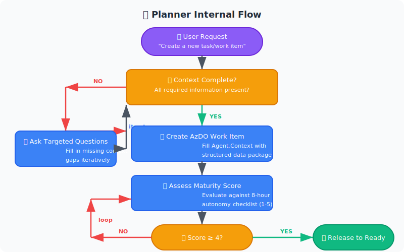
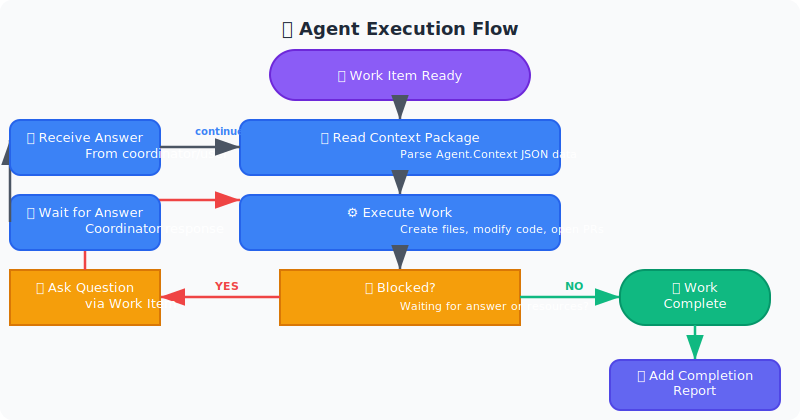
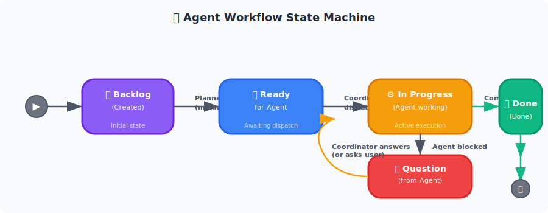

# 🤖 Agent Planner

### Multi-Agent Orchestration System

> **Autonomous work execution powered by Azure DevOps work items as the coordination layer**

[](#)
[](#)
[](https://dev.azure.com/picteo)
[](https://github.com/cline/cline)
[](https://nodejs.org)

[](https://github.com/Picteo/develop)
[](#next-phases)
[](#maturity-levels)
[](https://code.visualstudio.com)

---
↑ **[Back to top](#readme)**

## 📐 Architecture Overview

> 💡 **Tip:** For the best viewing experience, open this document in VS Code with **Markdown Preview Enhanced** or **Markdown All in One** extensions, or view the rendered preview (`Ctrl+Shift+V` / `Cmd+Shift+V`).

### 🏗️ System Architecture

<div align="center">

</div>

### 🎯 Planner Internal Flow

<div align="center">

</div>

### 🤖 Agent Execution Flow

<div align="center">

</div>

↑ **[Back to top](#readme)**

## 🔄 How It Works

<details>
<summary><strong>Click to expand workflow details</strong></summary>

### 1. 👤 User Interaction

The user describes what needs to be done:

> 💡 **Example Requests:**
> - *"Add user authentication to the dashboard"*
> - *"Fix the login page crash after password reset"*
> - *"Create a new API endpoint for user profiles"*

### 2. 📝 Planner Creates Work Item

The **Planner** performs the following:

1. **Asks targeted questions** to fill context gaps
2. **Creates a Task or Bug** in Azure DevOps
3. **Fills in structured context** (Agent.Context field)
4. **Self-assesses maturity** (1-5 scale)
5. **Iterates until maturity ≥ 4**

### 3. 📋 Coordinator Dispatches

The **Coordinator** handles:

- Monitors for **"Ready for Agent"** work items
- Assigns work items to **available agents**
- Provides **additional context** if needed

### 4. 🤖 Agent Executes

The **Agent**:

- Reads the work item and its **structured context**
- Executes the work **autonomously** (up to 8 hours)
- Can **create files, modify code, create repos, open PRs**
- Reports **questions** via work item if blocked

### 5. 💬 Coordinator Responds

If the agent asks a question:

1. **Coordinator** first tries to answer from available context
2. If context is insufficient → **asks the user**
3. User answers → **coordinator updates work item** → agent continues

### 6. ✅ Agent Completes

When the agent finishes:

- Updates work item state to **"Done"**
- Adds **completion report** to work item
- May **create a pull request** for the changes

</details>

↑ **[Back to top](#readme)**

## 📁 Project Structure

<details>
<summary><strong>Click to expand directory structure</strong></summary>

```text
agent-planner/
├── 📄 agent.yaml              # Agent identity and capabilities configuration
├── 📖 README.md               # This file - project overview & setup guide
├── 📋 SAMPLE-WORKITEM.md      # Complete example of a mature work item
│
├── 📁 prompts/                # LLM prompts for agent orchestration
│   ├── system.md              # Planner system prompt
│   ├── create-task.md         # Task creation template
│   ├── create-bug.md          # Bug creation template
│   ├── update-workitem.md     # Work item refinement template
│   └── maturity-check.md      # 8-hour autonomy maturity checklist
│
└── 📁 schemas/                # Data validation schemas
    └── workitem-context.json  # JSON schema for structured context packages
```

</details>

↑ **[Back to top](#readme)**

## ⚙️ Azure DevOps Setup

> 📌 **Prerequisites:**
> - Azure DevOps organization access (`https://dev.azure.com/picteo`)
> - `az devops` CLI configured with authentication
> - Contributor or Project Admin permissions

<details>
<summary><strong>Step 1: Create Project</strong></summary>

```bash
# Using Azure DevOps CLI or web portal
az devops project create \
  --name "Agent-Planner" \
  --organization "https://dev.azure.com/picteo"
```

</details>

<details>
<summary><strong>Step 2: Create Custom Fields</strong></summary>

The following **custom fields** are required for the agent coordination system:

| Field Name | Internal Name | Type | Values | Description |
|:--|:--|:--|:--|:--|
| 👤 **Agent Context** | `Custom.AgentContext` | String (Plain Text) | Free text | Structured JSON context package for agent execution |
| 🔄 **Agent State** | `Custom.AgentState` | Picklist | `Backlog` → `Ready for Agent` → `In Progress` → `Question from Agent` → `Done` | Agent workflow state |
| ⚡ **Autonomy Level** | `Custom.AgentAutonomyLevel` | Picklist | `Full`, `Partial`, `Manual` | How autonomous the agent should be |
| 📊 **Completion Report** | `Custom.AgentCompletionReport` | String (Plain Text) | Free text | Agent's summary of what was done |
| ❓ **Agent Question** | `Custom.AgentQuestion` | String (Multi-line) | Free text | Question raised by agent when blocked |
| 💬 **Coordinator Answer** | `Custom.CoordinatorAnswer` | String (Multi-line) | Free text | Response from coordinator or user |
| 🎯 **Maturity Score** | `Custom.PlannerMaturityScore` | Integer | `1` - `5` | Self-assessed maturity for 8-hour autonomy |

</details>

<details>
<summary><strong>Step 3: Configure Work Item Types</strong></summary>

Apply custom fields to **Task** and **Bug** work item types:

**📝 Task Form Layout:**
| Tab | Fields |
|:--|:--|
| **General** | Title, Description, State, Area Path, Iteration Path, Priority |
| **Agent** | `Agent.Context`, `Agent.State`, `Agent.AutonomyLevel`, `Planner.MaturityScore` |
| **Communication** | `Agent.Question`, `Coordinator.Answer` |
| **Completion** | `CompletionReport` |

**🐛 Bug Form Layout:**
| Tab | Fields |
|:--|:--|
| **General** | Title, Description, State, Area Path, Iteration Path, Priority, Severity |
| **Agent** | `Agent.Context`, `Agent.State`, `Agent.AutonomyLevel`, `Planner.MaturityScore` |
| **Communication** | `Agent.Question`, `Coordinator.Answer` |

</details>

<details>
<summary><strong>Step 4: Create Process (Optional)</strong></summary>

For a **clean experience**, create a custom process based on Agile:

```bash
# Clone the Agile process
az boards process clone \
  --org "https://dev.azure.com/picteo" \
  --id Agile \
  --new-name "Agent-Planner"

# Add custom fields to the cloned process
# (Use the Azure DevOps web portal or Azure DevOps CLI)
```

</details>

<details>
<summary><strong>Step 5: Create Sprints</strong></summary>

Sprints follow the format: **`Sprint YYYY-Www`**

**Examples:**
- `Sprint 2026-W29` → Week 29 of 2026
- `Sprint 2026-W30` → Week 30 of 2026

**Create sprints via:**
1. Azure DevOps → **Boards** → **Sprints** → **Configure Sprints**
2. Or use the **Azure DevOps MCP tool** (when available)

</details>

↑ **[Back to top](#readme)**


## 🎯 Maturity Levels

> Minimum release threshold: **Score ≥ 4**

| Score | Level | Description | Action |
|:--:|:--:|:--|:--|
| 🔴 **1** | 🥚 Raw | Just an idea, needs significant refinement | Gather requirements |
| 🟠 **2** | 📝 Draft | Basic description, missing technical details | Add technical details |
| 🟡 **3** | ✨ Defined | Core details present, some edge cases missing | Address edge cases |
| 🟢 **4** | 🚀 Mature | Ready for agent execution with minimal guidance | **Release to Agent** ✅ |
| 🟢 **5** | 💎 Complete | Fully specified, all edge cases covered | Release immediately ⚡ |

---

## 🤖 Agent Configuration

> **Two deployment options available:** CLI mode for autonomous operation or VS Code for visual monitoring

<details open>
<summary><strong>⭐ Option 1: Cline CLI</strong> <em>(Recommended for Autonomous Agents)</em></summary>

Cline CLI is installed and ready for **headless, autonomous agent operation**.

##### 📦 Installation (Already Done ✅)

```bash
# Node.js 22+ (via nvm)
export NVM_DIR="$HOME/.nvm"
[ -s "$NVM_DIR/nvm.sh" ] && \. "$NVM_DIR/nvm.sh"
nvm install 22
nvm use 22

# Cline CLI
npm i -g cline
# ✅ Installed: cline v3.0.40
```

##### 🔧 Configure MCP Servers

Each agent needs access to **Azure DevOps** and **GitHub** MCP servers:

```bash
# Configure MCP servers for agent
cline mcp add azure-devops -- url "http://localhost:3000" --name "azure-devops"
cline mcp add github -- url "http://localhost:3001" --name "github"
```

**Manual settings location:** `~/.cline/data/settings/mcp.json`

##### 🚀 Run Planner Agent (CLI Mode)

```bash
export NVM_DIR="$HOME/.nvm"
[ -s "$NVM_DIR/nvm.sh" ] && \. "$NVM_DIR/nvm.sh"
nvm use 22

# Run planner with system prompt
cline -s "$(cat prompts/system.md)" \
      -c /home/twan/Documents/develop/agent-planner \
      --auto-approve true \
      "Create a new task work item for: Add user authentication to dashboard"
```

##### ⏱️ Run Coordinator Agent (Scheduled)

```bash
# Create a cron job to poll for ready work items
crontab -e
# Add: */5 * * * * /home/twan/Documents/develop/agent-planner/scripts/poll-and-dispatch.sh
```

**`poll-and-dispatch.sh`:**
```bash
#!/bin/bash
export NVM_DIR="$HOME/.nvm"
[ -s "$NVM_DIR/nvm.sh" ] && \. "$NVM_DIR/nvm.sh"
nvm use 22

cline -s "$(cat prompts/system.md)" \
      --auto-approve true \
      --timeout 300 \
      "Check for work items in 'Ready for Agent' state and dispatch to available agents"
```

##### 📊 Run Agent with Kanban Board

```bash
# Launch the kanban board for multi-agent orchestration
cline --kanban
# Opens: http://localhost:3484
```

##### 👥 Run Agent with Team Mode

```bash
# Create a coordinator with specialists
cline --team-name agent-orchestrator \
      -s "$(cat prompts/system.md)" \
      "Process all work items in 'Ready for Agent' state"
```

##### 🎬 Example: Autonomous Agent Execution

```bash
# Agent receives work item context and executes autonomously
cline --auto-approve true \
      --worktree \
      -c /tmp/agent-worktree \
      -s "$(cat prompts/system.md)" \
      "Execute work item #42: Add CSV export functionality.
       Context: $(cat /tmp/workitem-42-context.json)"
```

</details>

<details>
<summary><strong>Option 2: VS Code + Cline Extension</strong> <em>(Visual Monitoring)</em></summary>

Each agent can run as a **separate VS Code instance** with the Cline extension for visual monitoring:

1. **Install VS Code** (if not already installed)
2. **Install Cline extension** from the VS Code marketplace
3. **Configure MCP servers** in Cline settings:
   - 🟦 Azure DevOps MCP (for AzDO operations)
   - 🐙 GitHub MCP (for repository operations)
4. **Load the `agent.yaml`** configuration file
5. **Set the system prompt** from `prompts/system.md`

**Run multiple VS Code instances simultaneously:**

```bash
# Agent 1 - VS Code instance 1
code --user-data-dir=/tmp/agent1-vscode \
     --extensions-dir=/tmp/agent1-extensions \
     --new-window

# Agent 2 - VS Code instance 2
code --user-data-dir=/tmp/agent2-vscode \
     --extensions-dir=/tmp/agent2-extensions \
     --new-window
```

</details>

↑ **[Back to top](#readme)**

## 🗂️ Work Item States

### 🔄 Agent Workflow State Machine

<div align="center">

</div>

## 📋 Sample Work Item

> 💡 See [**SAMPLE-WORKITEM.md**](SAMPLE-WORKITEM.md) for a complete example of a **mature, release-ready** work item.

---

## 📚 Prompts Reference

| Prompt | Purpose | When to Use |
|:--|:--|:--|
| [📜 **system.md**](prompts/system.md) | Planner system identity and behavior | Always active |
| [📝 **create-task.md**](prompts/create-task.md) | Task work item template | Creating features/enhancements |
| [🐛 **create-bug.md**](prompts/create-bug.md) | Bug work item template | Creating bug reports |
| [🔄 **update-workitem.md**](prompts/update-workitem.md) | Work item refinement | Adding context to existing items |
| [✅ **maturity-check.md**](prompts/maturity-check.md) | 8-hour autonomy checklist | Assessing readiness |

---

## 📐 Schema Reference

| Schema | Purpose | Location |
|:--|:--|:--:|
| [📄 **workitem-context.json**](schemas/workitem-context.json) | JSON schema for `Agent.Context` field | `schemas/` |

---

## ⚠️ Limitations & Known Issues

> [!WARNING]
> Be aware of these known limitations before deploying.

| # | Issue | Description |
|:-:|:--|:--|
| 1 | 🔌 **Azure DevOps MCP Connection** | The Azure DevOps MCP server may experience timeout issues. Ensure the MCP server is running and accessible. |
| 2 | 🏗️ **Custom Fields** | Azure DevOps does not support truly custom fields on standard work item types without a custom process. Use the web portal to create fields like `Custom.AgentContext`. |
| 3 | 🔄 **State Field** | Azure DevOps does not allow replacing the built-in `State` field. Use a custom picklist field (`Custom.AgentState`) for the agent workflow state. |
| 4 | 🤖 **Headless Operation** | Running agents without user interaction requires additional setup (see "Autonomous Operation" section above). |

---

## 🚀 Next Phases

| Phase | Status | Description |
|:--:|:--:|:--|
| **1** | ✅ **Complete** | Planner Agent — Work item creation and maturity assessment |
| **2** | 📋 **Planned** | Supervisor Agent — Validates work item maturity before release |
| **3** | 📋 **Planned** | Coordinator + Mock Agents — Tests the full coordination cycle |
| **4** | 📋 **Planned** | Real Agents — VS Code instances executing work items autonomously |
| **5** | 📋 **Planned** | Production — Full production deployment with multiple teams |

---

## 📄 License

> **🔒 Internal use only** — © Picteo

---

<p align="center">
  <sub>🤖 Agent Planner — Multi-Agent Orchestration System<br>
  <sub>Built with ❤️ on <a href="https://dev.azure.com/picteo">Azure DevOps</a> × <a href="https://code.visualstudio.com">VS Code</a> × <a href="https://github.com/cline/cline">Cline</a></sub>
</p>

↑ **[Back to top](#readme)**
